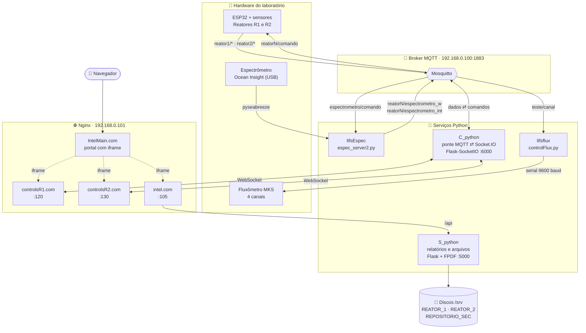
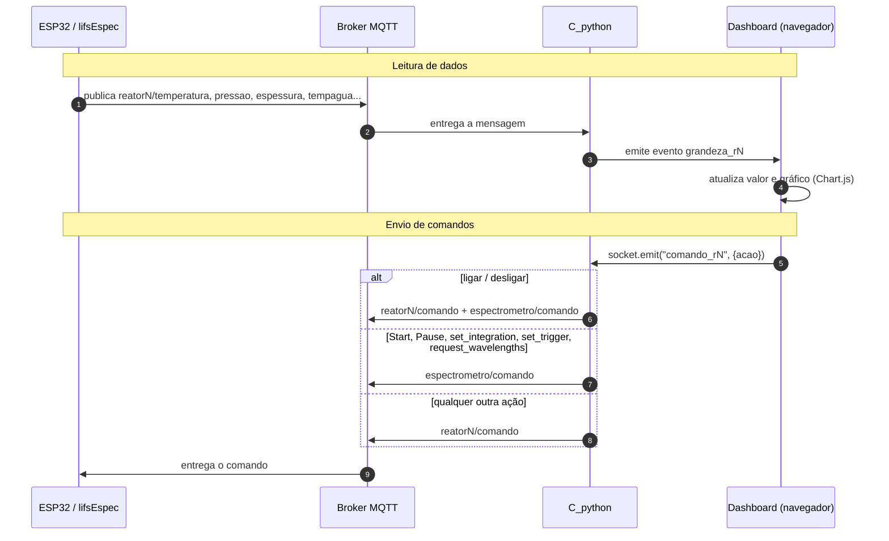

# LIFS-TARS

Plataforma web para **monitoramento, controle e registro de experimentos** em dois reatores de deposição de filmes finos do laboratório LIFS. O sistema junta numa só interface:

- leitura em tempo real dos sensores dos reatores (temperatura, pressão, espessura e temperatura da água);
- controle e visualização de um **espectrômetro Ocean Insight** compartilhado entre os dois reatores;
- controle de um **fluxômetro MKS de 4 canais** via porta serial;
- geração, edição e arquivamento de **relatórios de deposição em PDF**;
- um repositório de arquivos gerais com upload, pastas e extração de ZIP.

Toda a comunicação entre hardware e software passa por um **broker MQTT**; o navegador recebe os dados por **Socket.IO** (WebSocket).

---

## Sumário

1. [Arquitetura](#arquitetura)
2. [Estrutura do repositório](#estrutura-do-repositório)
3. [Tecnologias](#tecnologias)
4. [Módulos em detalhe](#módulos-em-detalhe)
5. [Tópicos MQTT e eventos Socket.IO](#tópicos-mqtt-e-eventos-socketio)
6. [API REST do backend documental](#api-rest-do-backend-documental)
7. [Rede, portas e implantação](#rede-portas-e-implantação)
8. [Instalação](#instalação)
9. [Pontos de atenção e melhorias sugeridas](#pontos-de-atenção-e-melhorias-sugeridas)

---

## Arquitetura



### Fluxo de leitura e de comandos



---

## Estrutura do repositório

```text
LIFS-TARS/
├── IntelMain.com/        Portal principal (menu lateral + iframe)
│   ├── index.html
│   └── styles.css
├── controlsR1.com/       Dashboard de monitoramento/controle do Reator 1
│   ├── index.html        Lógica de tela, gráficos e processamento espectral
│   ├── styles.css
│   ├── chart.js          Chart.js v4.5.0 (servido localmente)
│   └── socket.io.min.js  Cliente Socket.IO v4.5.4 (servido localmente)
├── controlsR2.com/       Mesma interface, ligada aos eventos do Reator 2
├── intel.com/            Frontend de relatórios e arquivos
│   ├── index.html        Lista de relatórios por reator
│   ├── gerador.html      Formulário de deposição → PDF (criar/editar)
│   ├── arquivos.html     Gerenciador de arquivos gerais
│   ├── script.js
│   └── styles.css
├── C_python/             Ponte MQTT ⇄ Socket.IO
│   └── app.py
├── S_python/             Backend documental (Flask + FPDF)
│   ├── app.py
│   ├── DejaVuSans.ttf         Fonte Unicode usada nos PDFs
│   └── DejaVuSans-Bold.ttf
├── lifsEspec/            Servidor do espectrômetro
│   └── espec_server2.py
├── lifsflux/             Controle do fluxômetro via serial
│   └── controlFlux.py
├── Backup/               Cópia anterior de todos os módulos (inclui um
│                         protótipo de interface do fluxômetro: lifsFlux/index.html)
└── init.sh               Reinicia os serviços systemd (nginx, flask, control)
```

Cada pasta tem um `README.md` próprio com um resumo do módulo.

---

## Tecnologias

| Camada | Tecnologia | Uso no projeto |
|---|---|---|
| Linguagem backend | **Python 3** (bytecode em `cpython-311`, ou seja, Python 3.11) | Todos os serviços |
| Web/API | **Flask** | `S_python` (REST) e `C_python` (servidor Socket.IO) |
| Tempo real | **Flask-SocketIO** + **eventlet** | WebSocket entre servidor e navegadores |
| Mensageria | **MQTT** com **paho-mqtt** | Barramento entre ESP32, espectrômetro, fluxômetro e servidor |
| Espectrometria | **python-seabreeze** (backend `pyseabreeze`) + **NumPy** | Leitura do espectrômetro Ocean Insight; dados enviados como `float32` binário |
| Serial | **pySerial** | Comandos ASCII para o fluxômetro (`/dev/ttyUSB0`, 9600 baud) |
| PDF | **FPDF** (com fontes DejaVu para acentos e símbolos como °, µ, Ω, Å) | Relatórios de deposição |
| Arquivos | **Werkzeug** (`secure_filename`, `safe_join`), `zipfile`, `shutil` | Upload, extração de ZIP, remoção |
| Frontend | **HTML5, CSS3, JavaScript puro** (sem framework) | Todas as interfaces |
| Gráficos | **Chart.js v4.5.0** | Séries temporais e espectro |
| Cliente WebSocket | **Socket.IO client v4.5.4** | Dashboards dos reatores |
| Servidor web | **Nginx** | Serve os frontends estáticos e faz proxy de `/api` e `/socket.io` |
| Serviços | **systemd** | Unidades `nginx`, `flask` e `control` (ver `init.sh`) |
| Hardware | ESP32 (sensores dos reatores), espectrômetro Ocean Insight, fluxômetro MKS de 4 canais | — |
| Armazenamento | Discos montados em `/srv/dev-disk-by-uuid-...` (padrão de NAS tipo OpenMediaVault) | PDFs/JSON dos reatores e repositório geral |

---

## Módulos em detalhe

### IntelMain.com — portal principal

Página única com barra superior, menu lateral recolhível (botão ☰) e um `<iframe name="content">`. Os links do menu abrem as outras aplicações dentro do iframe:

| Item do menu | Endereço |
|---|---|
| Interface de Arquivos | `http://192.168.0.101:105/` |
| Interface de Controle R1 | `http://192.168.0.101:120/` |
| Interface de Controle R2 | `http://192.168.0.101:130/` |

### controlsR1.com / controlsR2.com — dashboards dos reatores

As duas pastas são idênticas, exceto pelo sufixo dos eventos (`_r1` / `_r2`) e pelo título.

**Leituras exibidas** (valor atual + gráfico de linha com as últimas 10 amostras):

- Temperatura (°C)
- Pressão
- Espessura (Å)
- Temperatura da água (°C)
- Status do espectrômetro (Online/Offline — fica Online ao receber os comprimentos de onda)

**Controles:**

- **Ligar / Desligar** o reator (também liga/desliga o espectrômetro para aquele reator).
- **Start / Pause** da aquisição espectral.
- **Tempo de integração** do espectrômetro, em µs (padrão 100 000 µs).
- **Modo de trigger**: *Free running* ou *Trigger externo*.
- **Escala Y máxima** do gráfico espectral (padrão 70 000 contagens).

**Processamento espectral no navegador:**

- O espectro chega como `Float32Array` binário; os comprimentos de onda chegam uma vez e as intensidades a cada leitura. Se as intensidades chegarem antes dos comprimentos de onda, a página pede o reenvio (`request_wavelengths`).
- O gráfico mostra duas curvas:
  - **Intensidade instantânea** — o último frame completo;
  - **Intensidade acumulada** — média de *N* frames (campo "Frames a acumular", padrão 2) dentro da faixa λ mín–λ máx (padrão 400–700 nm), com subtração de um fator de fundo (campo "Fator de subtração").
- A atualização do gráfico é limitada a uma a cada 100 ms.
- **Gerar TXT do Espectro** baixa dois arquivos: `espectro.txt` (instantâneo, com o tempo de integração no cabeçalho) e `espectro_X.txt` (acumulado, com nº de frames e fator de subtração). Formato: `Wavelength(nm) Intensities(Count)`, uma linha por ponto.

### intel.com — relatórios e arquivos (frontend)

Todas as chamadas vão para `/api/...`, que o Nginx encaminha para o `S_python`.

- **`index.html`** — escolhe o reator e lista os PDFs dele, com botões para abrir, **Editar** (abre o gerador já preenchido) e **Remover**.
- **`gerador.html`** — formulário de dados de deposição da amostra:
  - 23 campos: nome da amostra, materiais, temperaturas inicial/final, fonte de energia, potência, pressões de base/Ar/O₂/total (inicial e final), fluxo de Ar, tempo de deposição, distância, alvo, frequência, TP, RSH e RLIM, observações;
  - **Parâmetros de deposição** — tabela com linhas fixas (Tempo, Vdc, Idc, Vos, Vsh, Delay) e colunas adicionáveis;
  - **Parâmetros do FM** — nº da amostra × espessura (Å), linhas adicionáveis;
  - **Parâmetros 4 pontas** — nº da amostra × resistência (Ω), linhas adicionáveis.

  No modo novo, envia para `POST /api/pdf`; no modo edição (`?reator=...&arquivo=...`), carrega o JSON salvo e regrava via `POST /api/salvar_pdf/...`.
- **`arquivos.html`** — navegador de pastas do repositório geral: upload múltiplo (arquivos `.zip` são extraídos automaticamente numa pasta com o mesmo nome), criar pasta, entrar/voltar diretório, abrir/baixar e remover.

### S_python — backend documental

Aplicação Flask que:

- gera PDFs de relatório com FPDF, organizando os campos em duas colunas e quebrando as tabelas em blocos de até 6 colunas de dados (com quebra de página automática);
- salva, ao lado de cada PDF, um **JSON com os dados de origem**, o que permite reabrir e editar o relatório;
- evita sobrescrever arquivos gerando nomes únicos (`amostra.pdf`, `amostra_1.pdf`, …);
- guarda os relatórios em diretórios separados por reator e mantém um repositório geral de arquivos.

Diretórios configurados no código:

| Chave | Caminho |
|---|---|
| `reator1` | `/srv/dev-disk-by-uuid-b49b7959-.../REATOR_1/` |
| `reator2` | `/srv/dev-disk-by-uuid-10efba6b-.../REATOR_2/` |
| `BASE_DIR` (arquivos gerais) | `/srv/dev-disk-by-uuid-0a22e152-.../REPOSITORIO_SEC` |

As fontes `DejaVuSans.ttf` e `DejaVuSans-Bold.ttf` precisam estar no diretório de trabalho do serviço.

### C_python — ponte MQTT ⇄ Socket.IO

- Conecta ao broker `192.168.0.100:1883` e assina `reator1/#`, `reator2/#` e `espectrometro/#`.
- Reemite cada mensagem como evento Socket.IO (ver tabela abaixo). Leituras escalares vão como `{"valor": "<texto>"}`; dados do espectrômetro vão como binário puro.
- Recebe `comando_r1` / `comando_r2` dos dashboards e roteia:

| Ação recebida | Destino MQTT |
|---|---|
| `ligar`, `desligar` | `reatorN/comando` **e** `espectrometro/comando` (`ligar_rN` / `desligar_rN`) |
| `Start`, `Pause`, `request_wavelengths`, `set_integration:<µs>`, `set_trigger:<free\|external>` | `espectrometro/comando` |
| qualquer outra | `reatorN/comando` |

- Servidor em `0.0.0.0:6000`, modo assíncrono `eventlet`, CORS liberado.

### lifsEspec — servidor do espectrômetro

- Usa `seabreeze` com backend `pyseabreeze` (não depende da biblioteca C da Ocean Insight).
- Na inicialização, procura o espectrômetro em loop até encontrá-lo, aplica o tempo de integração (100 ms por padrão) e publica os comprimentos de onda para os dois reatores.
- Atende um único reator por vez: `ligar_r1` / `ligar_r2` escolhe para qual reator os dados vão.
- Com o equipamento ligado e em **Start**, lê as intensidades (até 5 tentativas em caso de erro de comunicação) e publica em `reatorN/espectrometro_int`, no máximo a cada 100 ms.
- Comandos aceitos em `espectrometro/comando`: `ligar_r1`, `ligar_r2`, `desligar`, `Start`, `Pause`, `set_integration:<µs>`, `request_wavelengths`, `set_trigger:free` (modo 0) e `set_trigger:external` (modo 3). A troca de trigger pausa a aquisição antes.
- Encerra fechando o espectrômetro e o cliente MQTT de forma segura (Ctrl+C).

### lifsflux — fluxômetro MKS

- Abre `/dev/ttyUSB0` a 9600 baud e envia comandos ASCII no formato `CH<n> <valor>` e `CH<n> ON|OFF`.
- Hoje o script aplica setpoints fixos na inicialização (CH1 = 28 ON, CH2 = 30 OFF, CH3 = 29 ON, CH4 = 80 ON).
- Conecta ao MQTT e assina `teste/canal`, mas o tratamento das mensagens ainda só imprime no console — a integração MQTT está em desenvolvimento.
- Em `Backup/lifsFlux/index.html` há um protótipo de painel web (tema escuro, um cartão por canal com fluxo em sccm e botão liga/desliga) ainda não ligado ao backend.

---

## Tópicos MQTT e eventos Socket.IO

| Tópico MQTT (entrada) | Evento Socket.IO emitido | Conteúdo |
|---|---|---|
| `reatorN/...temperatura...` | `temperatura_rN` | `{valor}` texto |
| `reatorN/...pressao...` | `pressao_rN` | `{valor}` texto |
| `reatorN/...espessura...` | `espessura_rN` | `{valor}` texto |
| `reatorN/...tempagua...` | `tempagua_rN` | `{valor}` texto |
| `reatorN/espectrometro_w` | `espectrometro_rN_w` | `float32[]` comprimentos de onda (nm) |
| `reatorN/espectrometro_int` | `espectrometro_rN_int` | `float32[]` intensidades (contagens) |

| Tópico MQTT (saída) | Quem publica | Quem consome |
|---|---|---|
| `reatorN/comando` | C_python | ESP32 do reator N |
| `espectrometro/comando` | C_python | lifsEspec |

> O roteamento em `C_python` é feito por substring no nome do tópico (`"temperatura" in topico`), então os nomes exatos publicados pelo ESP32 só precisam conter essas palavras.

---

## API REST do backend documental

Rotas do `S_python` (o frontend as acessa com o prefixo `/api`):

| Método | Rota | Descrição |
|---|---|---|
| `POST` | `/pdf` | Gera um PDF novo. Corpo: `{text, reator, tabelas, nome_arquivo}`. Salva PDF + JSON no diretório do reator e devolve o PDF. |
| `GET` | `/arquivos/<reator>` | Lista os PDFs de `reator1` ou `reator2`. |
| `GET` | `/visualizar/<reator>/<arquivo>` | Abre um PDF de reator. |
| `GET` | `/json/<reator>/<arquivo.pdf>` | Devolve o JSON de origem de um PDF (para edição). |
| `POST` | `/salvar_pdf/<reator>/<arquivo>` | Regrava JSON e PDF de um relatório existente. |
| `DELETE` | `/remover/<reator>/<arquivo>` | Remove o PDF e o JSON correspondente. |
| `GET` | `/listar?caminho=<pasta>` | Lista arquivos e pastas do repositório geral (cria a pasta se não existir). |
| `POST` | `/upload` | Upload multipart (`arquivo`, `caminho`); `.zip` é extraído. |
| `POST` | `/criar-pasta` | Cria pasta. Corpo: `{nome, caminho}`. |
| `POST` | `/remover` | Remove arquivo ou pasta (recursivo). Corpo: `{nome, caminho}`. |
| `GET` | `/arquivos/<caminho>` | Abre (PDF) ou baixa (demais) um arquivo do repositório geral. |

---

## Rede, portas e implantação

| Componente | Endereço / porta |
|---|---|
| Broker MQTT | `192.168.0.100:1883` |
| Servidor da aplicação (Nginx) | `192.168.0.101` |
| Arquivos (`intel.com`) | `:105` |
| Dashboard R1 | `:120` |
| Dashboard R2 | `:130` |
| C_python (Socket.IO) | `:6000` |
| S_python (Flask) | `:5000` (padrão do `app.run`) |

Os dashboards conectam com `io()` (mesma origem) e o `intel.com` chama `/api/...`, portanto o Nginx precisa:

- servir cada pasta estática na sua porta;
- encaminhar `/socket.io/` das portas 120 e 130 para `127.0.0.1:6000` (com *upgrade* de WebSocket);
- encaminhar `/api/` da porta 105 para o `S_python`, removendo o prefixo.

As configurações do Nginx e as unidades systemd **não estão versionadas**. Exemplo mínimo para referência:

```nginx
# Dashboard do Reator 1
server {
    listen 120;
    root /var/www/controlsR1.com;
    index index.html;

    location /socket.io/ {
        proxy_pass http://127.0.0.1:6000;
        proxy_http_version 1.1;
        proxy_set_header Upgrade $http_upgrade;
        proxy_set_header Connection "upgrade";
    }
}

# Relatórios e arquivos
server {
    listen 105;
    root /var/www/intel.com;
    index index.html;
    client_max_body_size 500M;

    location /api/ {
        proxy_pass http://127.0.0.1:5000/;   # a barra final remove o prefixo /api
    }
}
```

Para reiniciar tudo depois de uma alteração:

```bash
sh init.sh   # daemon-reload + restart/status de nginx, flask e control
```

---

## Instalação

### Requisitos

- Linux (os caminhos `/dev/ttyUSB0` e `/srv/...` assumem Linux)
- Python 3.11
- Nginx
- Um broker MQTT (ex.: Mosquitto) acessível na rede
- Acesso USB ao espectrômetro e à porta serial do fluxômetro

### Dependências Python

```bash
pip install flask flask-socketio eventlet paho-mqtt   # C_python
pip install flask fpdf werkzeug                        # S_python
pip install seabreeze pyusb numpy paho-mqtt            # lifsEspec
pip install pyserial paho-mqtt                         # lifsflux
```

> O código usa a API de callbacks do paho-mqtt 1.x (`mqtt.Client()` sem `CallbackAPIVersion`). Com paho-mqtt 2.x é preciso instalar `paho-mqtt<2` ou ajustar a criação do cliente.
>
> Para o pyseabreeze acessar o espectrômetro sem root, instale as regras udev: `seabreeze_os_setup`.

### Executando os serviços manualmente

```bash
# Ponte MQTT ⇄ WebSocket
cd C_python && python app.py

# Backend de relatórios (as fontes DejaVu precisam estar no diretório atual)
cd S_python && python app.py

# Espectrômetro (no computador ligado ao equipamento via USB)
cd lifsEspec && python espec_server2.py

# Fluxômetro (no computador ligado à porta serial)
cd lifsflux && python controlFlux.py
```

Antes de rodar, ajuste no código o IP do broker (`192.168.0.100`) e os diretórios de armazenamento do `S_python`.

---

## Pontos de atenção e melhorias sugeridas

Observados na leitura do código atual:

**Segurança** (o sistema deve ficar restrito à rede do laboratório):

- não há autenticação em nenhuma interface ou API;
- `C_python` aceita qualquer origem (`cors_allowed_origins='*'`);
- `S_python` roda com `debug=True`;
- `/remover`, `/criar-pasta`, `/listar` e `/upload` montam caminhos com `os.path.join` a partir do campo `caminho` sem validar `..`, o que permite sair do diretório base — vale aplicar a mesma checagem que já existe em `/arquivos/<caminho>`;
- arquivos ZIP são extraídos sem validar os caminhos internos.

**Inconsistências funcionais:**

- Em `/pdf` as pressões saem em **mTorr**; em `/salvar_pdf` saem em **Pa** (e TP/RSH ficam sem unidade). A primeira tabela também muda de título ("Dados de Perfilometria" × "Dados de Deposicao").
- O dashboard mostra a pressão em **atm** no texto e em **Pa** no gráfico.
- Na edição, o frontend envia `novo_nome`, mas o backend ignora — renomear um relatório não tem efeito.
- O espectrômetro atende um reator por vez; ligar o R2 com o R1 ativo redireciona os dados sem aviso.
- `C_python` considera qualquer tópico que não contenha `reator1` como sendo do reator 2.

**Organização do código:**

- `controlsR1.com` e `controlsR2.com` são cópias quase idênticas; um único `index.html` parametrizado pelo número do reator evitaria divergências.
- A geração de PDF está duplicada entre `/pdf` e `/salvar_pdf`.
- IPs, portas e caminhos estão fixos no código; um arquivo `.env` ou de configuração facilitaria a implantação.
- A pasta `Backup/` e os `__pycache__/` poderiam sair do repositório (o histórico do Git já preserva as versões antigas), com um `.gitignore`.
- Faltam no repositório: `requirements.txt`, configuração do Nginx e unidades systemd.
- Os READMEs de `C_python` e `S_python` citam arquivos e rotas que não existem no código (`mqtt_handler.py`, `socket_events.py`, `/download`, `/gerar_pdf`).

---

## Repositório

[github.com/GuilhermeBertola1/LIFS-TARS](https://github.com/GuilhermeBertola1/LIFS-TARS)

## Licença

Projeto desenvolvido para pesquisa e uso laboratorial. Nenhuma licença de código aberto foi definida até o momento.
